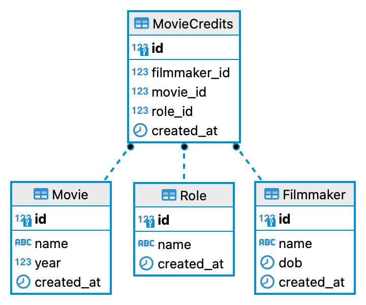

#crud movie database

## Database schema:

## Endpoints:
`GET /movies`: To retrieve a list of movies.

`GET /roles`: To retrieve a list of roles.

`GET /filmmakers`: To retrieve a list of filmmakers.

 

`GET /movie/:id`: To retrieve one movie given the ID.

`GET /filmmaker/:id`: To retrieve one filmmaker given the ID.

`GET /role/:id`: To retrieve one role given the ID.

 

`UPDATE /movie/:id`: To update one movie given the ID.

`UPDATE /filmmaker/:id`: To update one filmmaker given the ID.

`UPDATE /role/:id`: To update one role given the ID.

 

`POST /movie`: To create one movie given the ID.

`POST /filmmaker`: To create one filmmaker given the ID.

`POST /role`: To create one role given the ID.

 

`DELETE /movie/:id`: To delete a movie.

`DELETE /filmmaker/:id`: To delete a filmmaker.

`DELETE /role/:id`: To delete a role.

 

`POST /credit`: To create a movie credit.

`DELETE /credit/:id`: To delete a movie credit.

