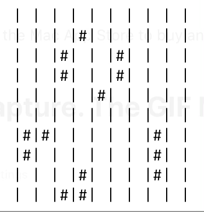

## pseudocode
```
// consts
const FPS
const WIDTH
const HEIGHT

// 2d array with default False values
var current_state = [
  [False, False,...],
  [False, False,...],
  ...
]


// main loop
while True {

  // calculate next state of life
  new_state = compute(current_state, WIDTH, HEIGHT)
  
  // drawing 
  draw(new_state, WIDTH, HEIGHT)
  
  current_state = new_state
  
  sleep(1/FPS) // to control execution speed
}

def compute(current_state, w, h) -> [][]bool:
  new_state = new_2d_array_filled_with_False(width, height)
  for y in h:
    for x in w:
      neighbours = count_neighours(current_state, x, y):
      if current_state[y][x] == True:
        if neighbours in [2,3]:
          new_state[y][x] = True
      else:
        if neighbours == 3:
          new_state[y][x] = True
              
  return new_state
 
def count_neighbours(state, x, y):
  def exists(state, x, y):
    if x not in len(state[0]) or y not in len(state):
      return False
    if state[x][y] == True:
      return True
    return False
    
    
  neighs = 0
  // 8 neighbours:
  neighbour_cors = [
    (x-1, y-1), (x, y-1), (x+1, y-1), (x+1, y), (x+1, y+1), (x, y+1), (x-1, y+1), (x-1, y)
  ]
  
  for a,b in neighbour_cors:
      if exists(state, a, b):
         neighs++
         
   return neighs
  
def draw(state, w, h):
  // just print to console
  
  for y in height:
    for x in width:
      if state[y][x] == True:
        print('#')
      else:
        print(' ')
``` 
## Gifs


