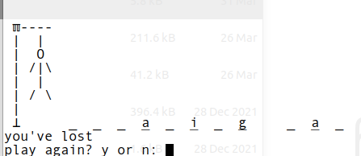

psudocode
```
hangman_img = [chars representing image of hangman]

words_list = ['abc', 'def', etc]

guesses = word = guessed_letters = None

def drawhangman():
    if guesses has len == 8
        pass
    else:
    - loop through img
    -  don't draw position if it's in guesses
    
def drawwords():
    print(x for x in word if x in guessed_letters else '_')

def getwinorlose():
    if guesses.length == 0:
        return 'lose'
    if guessed_letters.length == set(word.length.remove(' '))
        return 'win'

def init_state():
    set these global 
    guesses = [7 cordinates + None] # we won't draw these points
    word = random.pick(words_list)
    guessed_letters = []

while true:
  \# draw game
  drawhangman()
  drawwords()
  
  \# input
  win_or_lose = getwinorlose()
  if win or lose:
      print('win' if win else lose)
      again = ask('play again?')
      if not again:
          break
      else:
          initstate()
          contintue
          
  letter = None
  while letter not in alphabets or letter in guessed_letters:
      letter = getinput()
  
  \# process input
  if letter in word:
      guessed_letters.add(letter)
  else:
      guess = guesses.pop()
 ```
          

screenshots:
## Python

