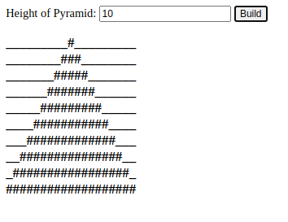

# Pseudo Code
```
def main():
  - get height and reverse from user input
  - get width = height * 2 - 1
  - get the grid data: pyramid data = pyramid(h, width)
  - then draw: draw(pyramid_data)

def pyramid(height, width):
  --- returns a 2-dimentional array, an upside down pyramid ---
  make a '0' array with len: height * width
  for y in height:
    for x in width:
      if (width - y - 1) >= x >= y:
        fill array[y][x] with 1
    
  
def draw(data, reverse=False):
    - data is 2-dimentional array
```


------------------
## C#
Running in terminal...

- ``first argument`` is the ``height`` of the pyramid, say you want the height to be ``15``:

```
>> pyramid.exe 15

```
*=> A pyramid withe a height of 15 will be printed.*

- ``second argument`` is the reverse option, specified by the ``--reverse`` or ``-r`` flag.

```
>> pyramid.exe 15 -r

```
*=> The same pyramid with be upside down.*

## Javascipt:


